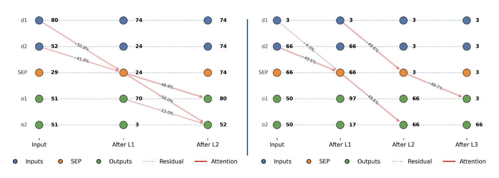

# Relative‑Magnitude Relational Composition in Attention‑Only Transformers

Code for the paper:
> Farrell, Theo, Patrick Leask, and Noura Al Moubayed. "Order by Scale: Relative‑Magnitude Relational Composition in Attention‑Only Transformers." Socially Responsible and Trustworthy Foundation Models at NeurIPS 2025.
Link: https://openreview.net/forum?id=vWRVzNtk7W



**Figure 1: Information flow visualization.** Red arrows show attention moving information between token positions (thickness indicates attention weight). The two-layer model (left, 92% accuracy) performs the desired composition at the SEP token, while the three-layer model (right, 100% accuracy) directly copies between positions, avoiding composition. Node numbers show logit lens activations; edge annotations show ablation impact on validation accuracy.

## Overview

This repository implements and analyzes transformers that learn to compress list representations into a special token and then decompress them. The task structure `[d1, d2, SEP, o1, o2]` enables clean mechanistic analysis of information flow through attention layers.

## Architecture

- **Attention-only transformer** (no MLPs)
- **2-3 layers** with single attention head per layer
- **Constrained weights**: Identity value and matrices ($W_V = W_O = I$)
- **Custom attention mask** to enforce causal structure and token-specific attention patterns

## Repository Structure

- `train.ipynb` - Model training with custom attention masks
- `interp_main.ipynb` - Mechanistic interpretability analysis
- `model_utils.py` - Model construction, attention masking, and utilities
- `data.py` - Dataset generation for list compression task
- `models/` - Trained model checkpoints

## Installation

```bash
pip install -r requirements.txt
```

## Usage

Training and interpretability analysis are provided in the Jupyter notebooks (.ipynb files).

## Dependencies

Built with [TransformerLens](https://github.com/TransformerLensOrg/TransformerLens) for mechanistic interpretability.

## Citation
```
@inproceedings{farrell2025order,
  title={Order by Scale: Relative-Magnitude Relational Composition in Attention-Only Transformers},
  author={Theo Farrell and Patrick Leask and Noura Al Moubayed},
  booktitle={Socially Responsible and Trustworthy Foundation Models at NeurIPS 2025},
  year={2025},
  url={https://openreview.net/forum?id=vWRVzNtk7W}
}
```
