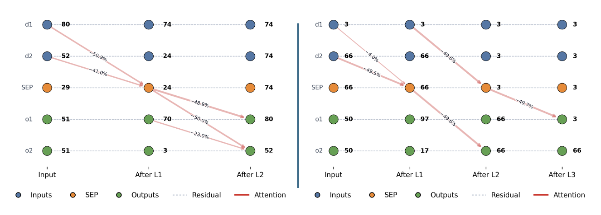

# Relative‑Magnitude Relational Composition in Attention‑Only Transformers

Code for the paper:
> Farrell, Theo, Patrick Leask, and Noura Al Moubayed. "Order by Scale: Relative‑Magnitude Relational Composition in Attention‑Only Transformers." Socially Responsible and Trustworthy Foundation Models at NeurIPS 2025. https://openreview.net/forum?id=vWRVzNtk7W

<p align="center">
  
  <br/>
  <em>Figure 1: Information flow visualization. Red arrows show attention moving information between token positions (thickness indicates attention weight). The two-layer model (left, 92% accuracy) performs the desired composition at the SEP token, while the three-layer model (right, 100% accuracy) directly copies between positions, avoiding composition. Node numbers show logit lens activations; edge annotations show ablation impact on validation accuracy.</em>
</p>

**TL;DR:** We find a new relational composition method based on relative vector magnitudes in a toy model, challenging the common view that transformer features can be treated as binary on/off switches.

## Overview

This repository implements and analyzes transformers that learn to compress list representations into a special token and then decompress them. The task structure `[d1, d2, SEP, o1, o2]` enables clean mechanistic analysis of information flow through attention layers.

## Architecture

- **Attention-only transformer** (no MLPs)
- **2-3 layers** with single attention head per layer
- **Constrained weights**: Identity value and matrices ($W_V = W_O = I$)
- **Custom attention mask** to enforce causal structure and token-specific attention patterns

## Repository Structure

```
├── train.py              # Training script (CLI)
├── interp.ipynb          # interpretability analysis / figures notebook
├── src/
│   ├── model_utils.py    # Model construction, attention masking, and utilities
│   ├── datasets.py       # Dataset generation for list compression task
│   ├── runtime.py        # Shared runtime configuration
│   └── interp_utils.py   # Interpretability helper functions
├── models/               # Pre-trained model checkpoints
└── figures/              # Paper figures
```

## Installation

Dependencies are managed with [`uv`](https://docs.astral.sh/uv/). Run `uv sync` to install all dependencies into a local virtual environment.

## Usage

**Training:**

```bash
python3 train.py                        # default: 2-layer, 1-head, d=64, 100 digits
python3 train.py --n-layers 3 --max-steps 200000
python3 train.py --help                 # full list of options
```

Key flags: `--n-layers`, `--n-heads`, `--d-model`, `--n-digits`, `--list-len`, `--ln`, `--wv`, `--wo`, `--mlp`, `--wandb`.

Trained checkpoints are saved to `models/`.

**Interpretability:** Open `interp.ipynb` and run cells top-to-bottom. It loads a checkpoint from `models/` and performs mechanistic analysis — attention pattern visualisation, ablation studies, and logit lens inspection. Pre-trained checkpoints are included so you can run the analysis without training from scratch.

**Weights & Biases:** Copy `.env.example` to `.env` and fill in your credentials, then pass `--wandb` to `train.py`.

## Dependencies

Built with [TransformerLens](https://github.com/TransformerLensOrg/TransformerLens) for mechanistic interpretability.

## Citation

```
@inproceedings{farrell2025order,
  title={Order by Scale: Relative-Magnitude Relational Composition in Attention-Only Transformers},
  author={Theo Farrell and Patrick Leask and Noura Al Moubayed},
  booktitle={Socially Responsible and Trustworthy Foundation Models at NeurIPS 2025},
  year={2025},
  url={https://openreview.net/forum?id=vWRVzNtk7W}
}
```
